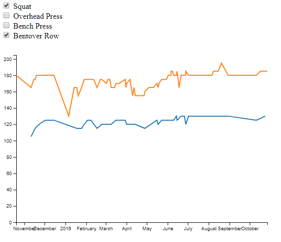

# Workout Visualizer

The goal of this project is to visualize my workouts in two views:
1) Calendar view: see days that I've worked out
2) Graph view: my progress in specific lifts.

It uses a SQLite3 database to store my workout data, uses Python + SQLAlchemy + Flask for a RESTful API to access data, and D3 to visualize.

To start the app, run:
```sh
> python app.py
```


I've included a sample SQLite database. See the folder `create_db/` to see how you can import your own CSV file into a SQLite database using SQLAlchemy.

Screenshots:


